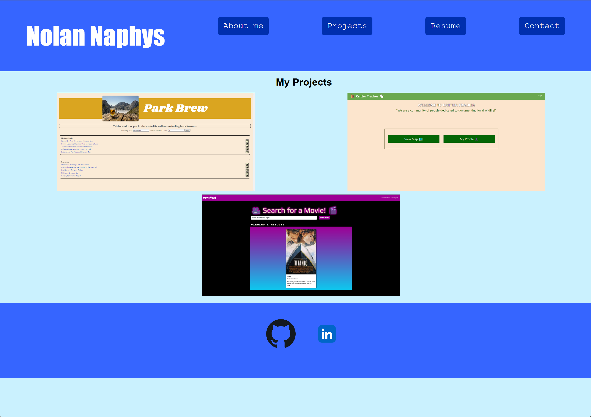
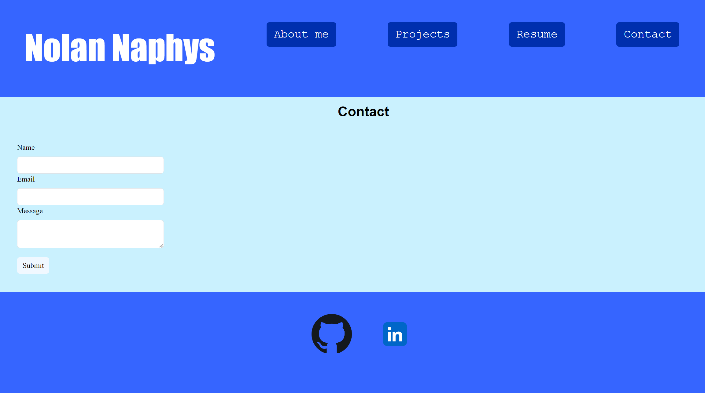

# Nolan Naphys React Portfolio
## Description
A professional portfolio built using React. The portfolio contains links to my completed projects, a resume of skills and know technologies, and has a for that users can fill out to contact me.

## Usage

- Users can navigate the site from the navbar

- On the Projects page users can highlight a project image to see the description. Clicking on the project name will take you to the deployed site. Clicking on the Github logo will navigate to the github repository.

- On the contact page just fill out the fields and click submit.

## License

## Links

[Deployed Site](https://nolannaphys-react-portfolio.netlify.app/)

[Personal Github](https://github.com/nolannaphys)

